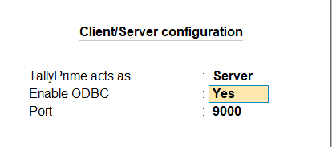
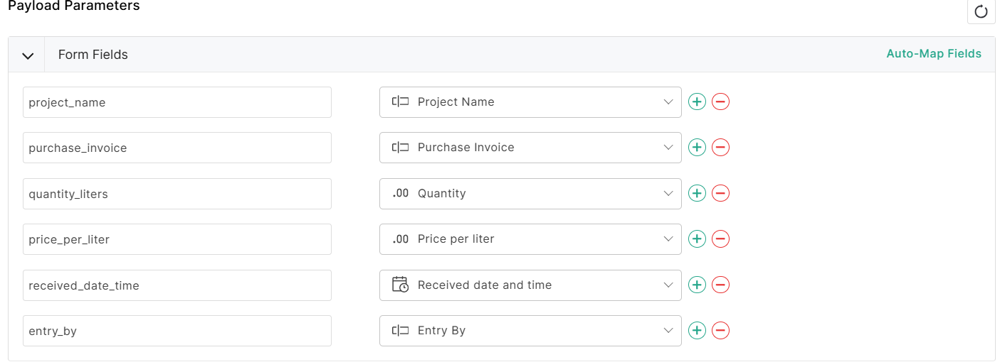
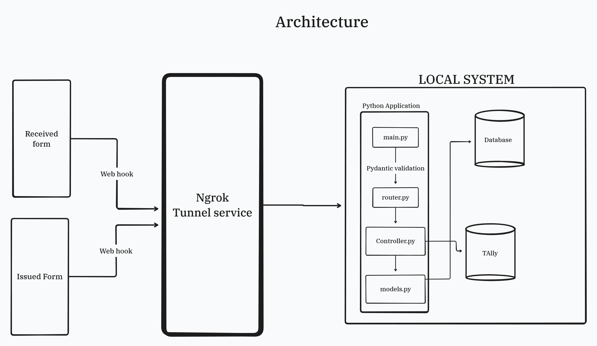

## Project Requirements

- Python version 3.11
- Ngrok
- pipenv
- sqllite
- tally prime

## Project setup

### Python server setup

1. Clone the project
2. Install python on the system
3. After installing python install the python package 'pipenv' by running the command `pip install pipenv`
4. Navigate to cloned project directory
5. In the root of project run command `pipenv install`. This installs all the required dependencies to run the python
   application
6. Create a file in the root of the project named .env and add the following values to it
   PROD_DATABASE_URL = "sqlite:///./data/chainagex.db"
   TEST_DATABASE_URL = "sqlite:///./data/test.db"
   TALLY_URL = "http://localhost:9000"
7. Now from the root of project run the command `pipenv run uvicorn app.main:app --port 8000` this starts the python
   server.

   NOTE - Before sending any request make sure Tally is running and the company is loaded.

### Ngrok

Zoho forms are integrated with python application using a webhook from the zoho platform. These
webhooks work perfectly fine when the server they are communicating with are deployed on a network (AWS EC2, Digital
Ocean, GCP).
In current scenario since we are running the server locally these webhooks won't be able to communicate with our systems
therefore we would need a tunneling service like ngrok that can sit in the middle of zoho webhooks and our locally
running servers.
Webhooks send the requests to ngrok server which then forwards the data to out locally running servers.

**Setting up ngrok**

1. Go the website `https://ngrok.com/`
2. Signup with a free account
3. Download the ngrok clint for windows
4. After the client is installed open the terminal run the command `ngrok config add-authtoken <auth-token>` there will
   be a token on the ngrok webpage add that.
5. There will also be a domain name on the page which would look like `https://<domain-name>.ngrok-free.dev` this will
   be the domain name on which zoho webhook will send the request which will then be forwarded to out locally running
   server
6. Open a new terminal window and run the command `ngrok http 8000`. Now ngrok is up and running to forward the request,
   keep this running till the app is running

### Tally prime

1. Install tally prime on windows
2. Activate it using education lisence
3. Create a company name `ChainageX`
4. Create two ledgers named Diesel Issued and Diesel Received
5. Navigate to tally gateway and press f1 and go to settings > connectivity > select client/server configuratoin and make the changes as seen in the image.
 
6. Restart tally

### Zoho forms

Go to zoho forms and signup for a free account. We will be creating two new forms one for diesel received and other for
diesel issued and also setting up the webhook integration

#### Diesel Received form

1. Create a new form
2. Add the following data fields to the form by referring correct data type from table (Data types should be identical)

   | Field Name             | Type                  |
   |------------------------|-----------------------|
   | Project Name           | Textbox - Single Line |
   | Purchase Invoice       | Textbox - Single Line |
   | Quantity               | Number - Decimal      |
   | Price per liter        | Number - Decimal      |
   | Received date and time | Date-Time             |

   The form should look like
   

3. Now click on the integration tab on the top of the form builder page and select webhoooks
4. In the webhook URL add the domain name we got from ngrok that looked like `https://<domain-name>.ngrok-free.dev`
   modify it by appending the `/api/received/diesel` finally it should look like
   `https://<domain-name>.ngrok-free.dev/api/received/diesel`
5. In content type select `application/json`
6. In the payload parameter add fields similar to the image below.

7. Save the webhook
8. Make sure python,ngrok and tally  are running locally 
9. Open form add data and submit and the data should be reflected in DB and tally

#### Diesel Issued form

1. Create a new form
2. Add the following data fields to the form by referring correct data type from table (Data types should be identical)
   
   | Field Name          | Type                  |
   |---------------------|-----------------------|
   | Project Name        | Textbox - Single Line |
   | Issued to           | Textbox - Single Line |
   | Issued by           | Textbox - Single Line |
   | Quantity            | Number - Decimal      |
   | Price per liter     | Number - Decimal      |
   | Issue date and time | Date-Time             |

The form should look like 

3. Now click on the integration tab on the top of the form builder page and select webhoooks
4. In the webhook URL add the domain name we got from ngrok that looked like `https://<domain-name>.ngrok-free.dev`
   modify it by appending the `/api/issued/diesel` finally it should look like
   `https://<domain-name>.ngrok-free.dev/api/issued/diesel`
5. 5. In content type select `application/json`
6. In the payload parameter add fields similar to the image below.
   
7. Save the webhook
8. Make sure python,ngrok and tally  are running locally
9. Open form add data and submit and the data should be reflected in DB and tally

## Architecture 

